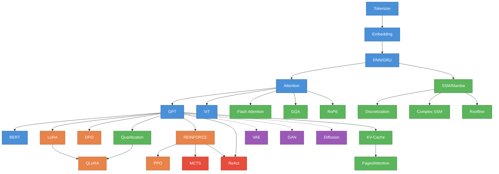

# 07 - 完整算法索引

本章节提供所有 47 个算法的快速参考，帮助你快速定位感兴趣的主题。

---

## 按字母序索引

| 算法 | 中文名 | 所在章节 | 难度 | 学习时长 |
|------|--------|----------|------|----------|
| Attention | 注意力机制 | 02-基础轨道 | ⭐⭐⭐ | 60分钟 |
| Bandit | 多臂老虎机 | 06-智能体轨道 | ⭐⭐ | 40分钟 |
| Batch Normalization | 批归一化 | 03-对齐轨道 | ⭐⭐ | 25分钟 |
| Beam Search | 束搜索 | 04-推理优化轨道 | ⭐⭐ | 35分钟 |
| BERT | 双向编码器 | 02-基础轨道 | ⭐⭐⭐ | 45分钟 |
| BM25 | 检索算法 | 04-推理优化轨道 | ⭐⭐ | 30分钟 |
| Checkpointing | 梯度检查点 | 04-推理优化轨道 | ⭐⭐⭐ | 30分钟 |
| Complex SSM | 复数状态空间模型 | 04-推理优化轨道 | ⭐⭐⭐⭐ | 40分钟 |
| Conv Net | 卷积神经网络 | 02-基础轨道 | ⭐⭐ | 45分钟 |
| Diffusion | 扩散模型 | 05-生成模型轨道 | ⭐⭐⭐⭐ | 60分钟 |
| Discretization | 离散化方法 | 04-推理优化轨道 | ⭐⭐⭐⭐ | 40分钟 |
| DPO | 直接偏好优化 | 03-对齐轨道 | ⭐⭐⭐ | 40分钟 |
| Dropout | 丢弃法 | 03-对齐轨道 | ⭐⭐ | 25分钟 |
| Embedding | 词嵌入 | 02-基础轨道 | ⭐⭐ | 40分钟 |
| Flash Attention | 快速注意力 | 04-推理优化轨道 | ⭐⭐⭐⭐ | 40分钟 |
| GAN | 生成对抗网络 | 05-生成模型轨道 | ⭐⭐⭐ | 50分钟 |
| GPT | 生成式预训练 | 02-基础轨道 | ⭐⭐⭐⭐ | 60分钟 |
| GQA | 分组查询注意力 | 04-推理优化轨道 | ⭐⭐⭐ | 40分钟 |
| GRPO | 组相对策略优化 | 03-对齐轨道 | ⭐⭐⭐ | 35分钟 |
| GRU | 门控循环单元 | 02-基础轨道 | ⭐⭐⭐ | 45分钟 |
| KV-Cache | 键值缓存 | 04-推理优化轨道 | ⭐⭐⭐ | 35分钟 |
| LoRA | 低秩适应 | 03-对齐轨道 | ⭐⭐⭐ | 35分钟 |
| LSTM | 长短期记忆网络 | 02-基础轨道 | ⭐⭐⭐ | 45分钟 |
| MCTS | 蒙特卡洛树搜索 | 06-智能体轨道 | ⭐⭐⭐⭐ | 90分钟 |
| Memory Network | 记忆网络 | 06-智能体轨道 | ⭐⭐⭐ | 50分钟 |
| Minimax | 极小化极大 | 06-智能体轨道 | ⭐⭐⭐ | 45分钟 |
| MoE | 专家混合 | 03-对齐轨道 | ⭐⭐⭐ | 35分钟 |
| Optimizer | 优化器 | 02-基础轨道 | ⭐⭐ | 45分钟 |
| PagedAttention | 分页注意力 | 04-推理优化轨道 | ⭐⭐⭐⭐ | 40分钟 |
| Parallelism | 模型并行 | 04-推理优化轨道 | ⭐⭐⭐ | 30分钟 |
| PPO | 近端策略优化 | 03-对齐轨道 | ⭐⭐⭐⭐ | 35分钟 |
| QLoRA | 量化LoRA | 03-对齐轨道 | ⭐⭐⭐ | 35分钟 |
| Quantization | 量化 | 04-推理优化轨道 | ⭐⭐⭐ | 40分钟 |
| RAG | 检索增强生成 | 02-基础轨道 | ⭐⭐⭐ | 50分钟 |
| ReAct | 推理-行动 | 06-智能体轨道 | ⭐⭐⭐⭐ | 90分钟 |
| REINFORCE | 强化学习基础 | 03-对齐轨道 | ⭐⭐⭐ | 35分钟 |
| ResNet | 残差网络 | 02-基础轨道 | ⭐⭐⭐ | 45分钟 |
| RNN | 循环神经网络 | 02-基础轨道 | ⭐⭐ | 45分钟 |
| RoPE | 旋转位置编码 | 04-推理优化轨道 | ⭐⭐⭐ | 35分钟 |
| Roofline | 性能分析模型 | 04-推理优化轨道 | ⭐⭐⭐⭐ | 40分钟 |
| Speculative Decoding | 推测解码 | 04-推理优化轨道 | ⭐⭐⭐ | 35分钟 |
| SSM/Mamba | 状态空间模型 | 04-推理优化轨道 | ⭐⭐⭐⭐ | 35分钟 |
| Tokenizer | 分词器 | 02-基础轨道 | ⭐⭐ | 30分钟 |
| VAE | 变分自编码器 | 05-生成模型轨道 | ⭐⭐⭐ | 50分钟 |
| Vector Search | 向量搜索 | 04-推理优化轨道 | ⭐⭐ | 30分钟 |
| ViT | 视觉Transformer | 02-基础轨道 | ⭐⭐⭐ | 45分钟 |

**难度说明**：
- ⭐⭐ 基础 - 适合初学者
- ⭐⭐⭐ 中级 - 需要理解基础概念
- ⭐⭐⭐⭐ 高级 - 需要深入理解和数学基础

---

## 按主题聚类

### 序列建模家族
从简单到复杂的序列建模演化

```
RNN → GRU/LSTM → Transformer (GPT/BERT) → SSM/Mamba
```

- **RNN**: 最基础的序列建模，梯度消失问题
- **GRU/LSTM**: 门控机制解决长程依赖
- **Transformer**: 注意力机制并行化
- **SSM/Mamba**: 线性时间复杂度

### 注意力机制家族
不同注意力变体的权衡

```
Multi-Head Attention → GQA → Flash Attention → Paged Attention
```

- **Multi-Head**: 标准多头注意力
- **GQA**: 分组查询，减少KV头数量
- **Flash Attention**: 内存高效，分块计算
- **Paged Attention**: 虚拟内存管理

### 生成模型家族
三种不同的生成范式

```
VAE (变分) | GAN (对抗) | Diffusion (扩散)
```

- **VAE**: 编码-解码 + 变分推断
- **GAN**: 生成器 vs 判别器
- **Diffusion**: 逐步去噪

### 对齐技术家族
让模型符合人类意图

```
微调 → LoRA/QLoRA → DPO/PPO
```

- **微调**: 全参数调整
- **LoRA**: 低秩适应，高效
- **QLoRA**: 量化 + LoRA
- **DPO/PPO**: 偏好对齐，RLHF

### 推理优化家族
部署时的效率技术

```
KV-Cache → Quantization → Speculative Decoding
```

- **KV-Cache**: 避免重复计算
- **Quantization**: 模型压缩
- **Speculative Decoding**: 推测加速

### 智能体决策家族
自主决策和规划

```
Bandit (探索-利用) → Minimax (对抗) → MCTS (树搜索) → ReAct (推理-行动)
```

---

## 依赖关系图



---

## 学习路径推荐

### 路径 1: 快速入门（8小时）
适合想快速了解核心概念的读者

1. Tokenizer → Embedding → Attention → GPT (4小时)
2. LoRA → DPO (2小时)  
3. Flash Attention → KV-Cache → Quantization (2小时)

### 路径 2: Transformer深度游（12小时）
深入理解现代语言模型

1. 基础轨道全部（8小时）
2. 对齐轨道：LoRA → QLoRA → DPO → PPO (3小时)
3. 推理优化：Flash Attention → RoPE → KV-Cache (1小时)

### 路径 3: 系统工程师路径（15小时）
关注部署和效率

1. GPT基础 (1小时)
2. 推理优化轨道全部（7小时）
3. LoRA/QLoRA（1小时）
4. SSM/Mamba → Discretization → Complex SSM （2小时）
5. Roofline分析（1小时）

### 路径 4: AI研究者路径（20小时）
全面理解算法演化

1. 基础轨道（8小时）
2. 对齐轨道（3小时）
3. 生成模型轨道（2.5小时）
4. 推理优化精选（3小时）
5. 智能体轨道（3小时）

---

## 前置依赖速查

想学某个算法但不知道需要哪些前置知识？查这里：

| 目标算法 | 必须先理解 | 建议先理解 |
|----------|------------|------------|
| GPT | Tokenizer, Embedding, Attention | RNN |
| BERT | GPT | - |
| LoRA | GPT | - |
| QLoRA | LoRA, Quantization | - |
| DPO | GPT | LoRA |
| PPO | REINFORCE, GPT | DPO |
| Flash Attention | Attention | - |
| KV-Cache | GPT | - |
| PagedAttention | KV-Cache | - |
| SSM/Mamba | RNN, GPT | - |
| Complex SSM | SSM | RoPE |
| Discretization | SSM | - |
| Roofline | SSM | Flash Attention |
| VAE | 01-核心概念 | - |
| GAN | 01-核心概念 | VAE |
| Diffusion | 01-核心概念 | VAE |
| MCTS | REINFORCE | - |
| ReAct | REINFORCE, GPT | - |

---

## 按应用场景查找

### 我想做文本生成
→ **Tokenizer → Embedding → GPT → Beam Search**

### 我想微调大模型
→ **LoRA → QLoRA → DPO**

### 我想部署模型
→ **Quantization → KV-Cache → Flash Attention → PagedAttention**

### 我想理解ChatGPT
→ **GPT → LoRA → DPO → PPO**

### 我想做图像生成
→ **VAE → GAN → Diffusion**

### 我想构建AI Agent
→ **GPT → REINFORCE → ReAct → MCTS**

### 我想优化推理速度
→ **KV-Cache → Flash Attention → Quantization → Speculative Decoding**

### 我想理解Mamba
→ **RNN → SSM → Discretization → Complex SSM → Roofline**

---

## 快速概念对比

### Transformer vs SSM
| 维度 | Transformer | SSM/Mamba |
|------|-------------|-----------|
| 时间复杂度 | O(n²) | O(n) |
| 内存 | O(n²) | O(1) |
| 训练并行性 | 完全并行 | 可并行（卷积形式） |
| 推理速度 | 慢（需要KV-Cache优化） | 快（状态更新O(1)） |
| 长序列 | 受限 | 擅长 |
| 全局信息 | 擅长 | 需要多层 |

### LoRA vs QLoRA
| 维度 | LoRA | QLoRA |
|------|------|-------|
| 基础模型 | 全精度 | 4bit量化 |
| 内存需求 | 中等 | 极低 |
| 训练速度 | 快 | 稍慢（量化开销） |
| 精度损失 | 几乎没有 | 轻微 |
| 适用场景 | 有GPU资源 | 消费级硬件 |

### VAE vs GAN vs Diffusion
| 维度 | VAE | GAN | Diffusion |
|------|-----|-----|-----------|
| 训练稳定性 | 稳定 | 不稳定 | 稳定 |
| 生成质量 | 中等（模糊） | 高（锐利但模式崩溃） | 极高 |
| 生成速度 | 快（一次前向） | 快 | 慢（迭代去噪） |
| 多样性 | 高 | 低（模式崩溃） | 高 |
| 训练难度 | 简单 | 困难 | 中等 |

---

## 本章小结

这个索引提供了：
✅ 47个算法的完整清单  
✅ 难度评级和学习时长估算  
✅ 依赖关系图  
✅ 多种学习路径  
✅ 应用场景导航  

**使用建议**：
- 把这个索引当作"地图"，随时回来查看
- 遇到不熟悉的概念，查"前置依赖"
- 根据自己的目标选择学习路径
- 不必线性学习，按需跳转即可

---

**下一步**：

- 查看具体算法？→ 回到对应轨道章节
- 需要更多资源？→ [08-深入探索](./08-深入探索.md)
- 想复习基础？→ [01-核心概念](./01-核心概念.md)
